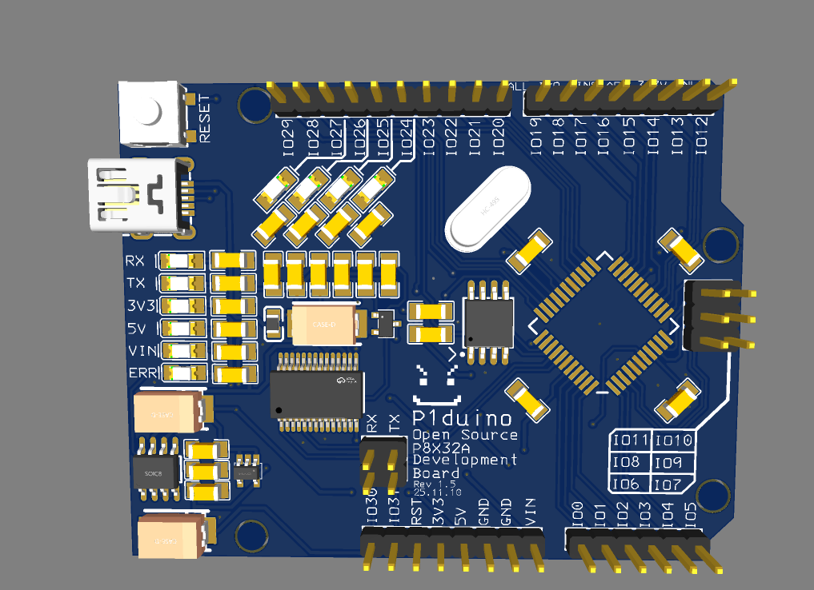
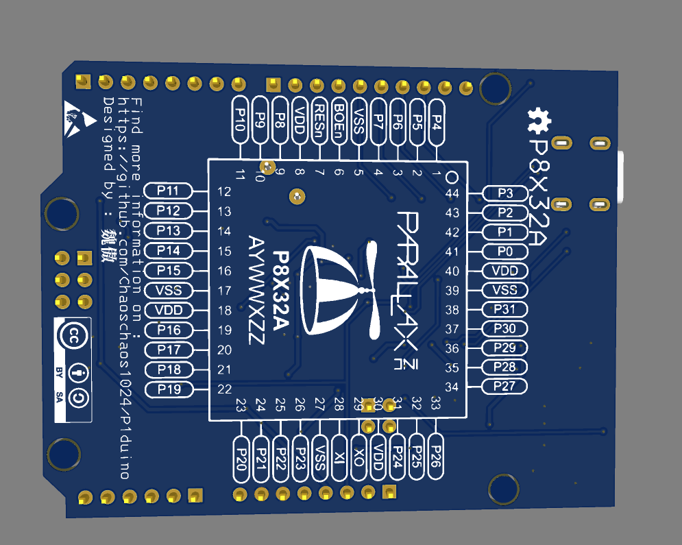

<!--
 * @Author: 无序熵增
 * @Date: 2025-11-10 17:08:58
 * @LastEditors: 无序熵增
 * @LastEditTime: 2025-12-18 19:17:52
 * @Description: 
 * 
 * Copyright (c) 2025 by 无序熵增, All Rights Reserved. 
-->
# P1DUINO - An Arduino-Shaped P8X32A Development Board

## What is P8X32A?

The Propeller chip is designed to provide high-speed processing for embedded systems while maintaining low current consumption and a small physical footprint. In addition to being fast, the Propeller chip provides flexibility and power through its eight processors, called cogs, that can perform simultaneous tasks independently or cooperatively, all while maintaining a relatively simple architecture that is easy to learn and utilize.

Two programming languages are available:
- **Spin** (a high-level object-based language)
- **Propeller Assembly**

Both include custom commands to easily manage the Propeller chip's unique features.

## Key Features

- **Arduino-Shaped Design** - Compatible with Arduino expansion boards
- **32 Smart Pins** - Versatile GPIO capabilities
- **8 Independent Cores** - High-performance parallel processing
- **Easy Manufacturing** - Single-sided surface mount design using 1206 resistors and capacitors
- **User-Friendly Design** - Clear pin markings, short-circuit protection, power indicator lights, and power failure indicator
- **Backside Documentation** - Complete instructions printed on the back for switch configuration and boot mode selection

## Propeller 1 P8X32A Specifications

### Development Languages
- **BlocklyProp** (graphical programming)
- **Spin** (native, object-based language)
- **Assembly** (native low-level language)
- **C/C++** (via open-source Propeller GCC toolchain)

### Electrical Specifications
- **Power Requirements:** 3.3 VDC
- **Operating Temperature:** -55°C to +125°C
- **External Clock Speed:** DC to 80 MHz
- **Internal RC Oscillator:** ~12 MHz or ~20 kHz

### Processing Capabilities
- **Processor Cores:** Eight 32-bit cores (cogs)
- **Execution Speed:** 0 to 160 MIPS (20 MIPS per cog)
- **I/O Pins:** 32 GPIO CMOS pins

### Memory Configuration
- **Global ROM/RAM:** 32,768 bytes / 32,768 bytes
- **Cog RAM:** 512 × 32 bits per core

